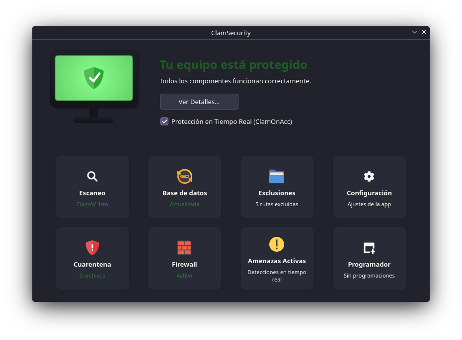
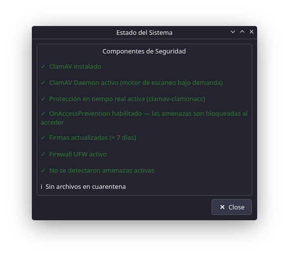
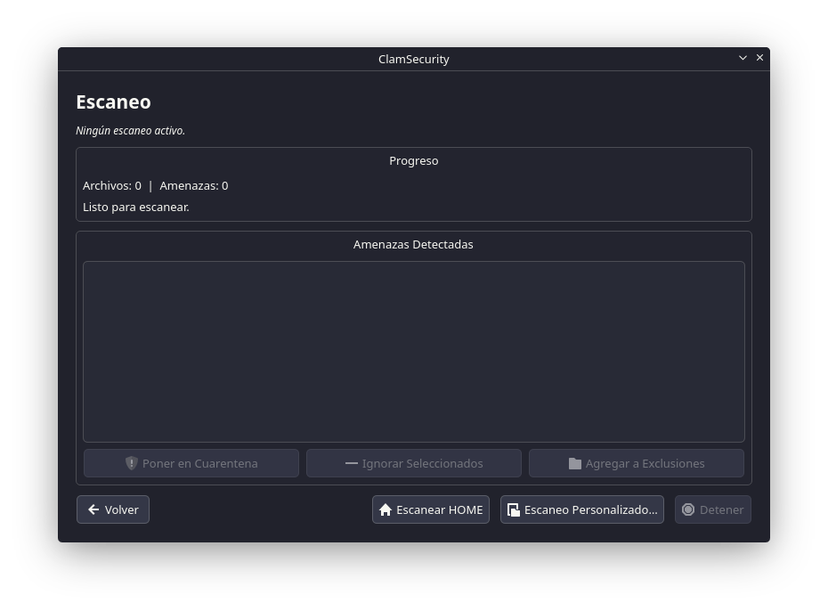
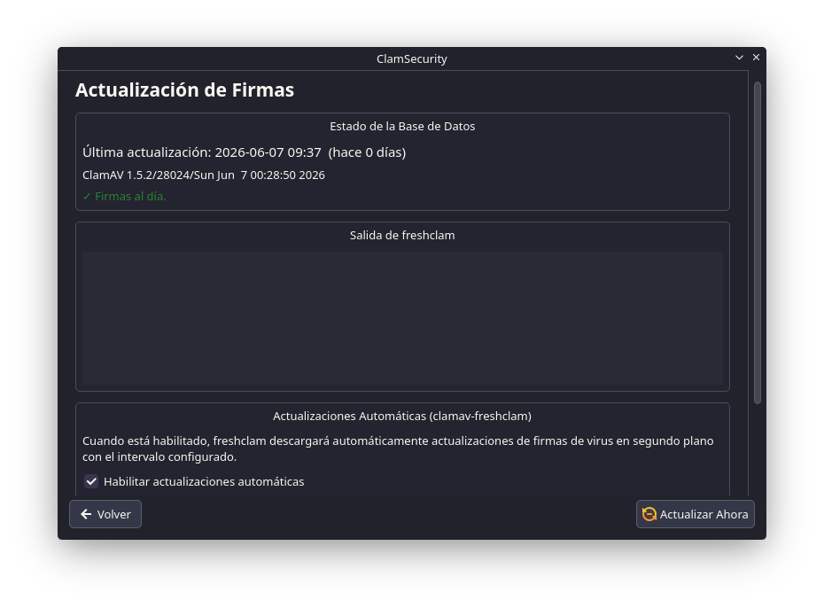
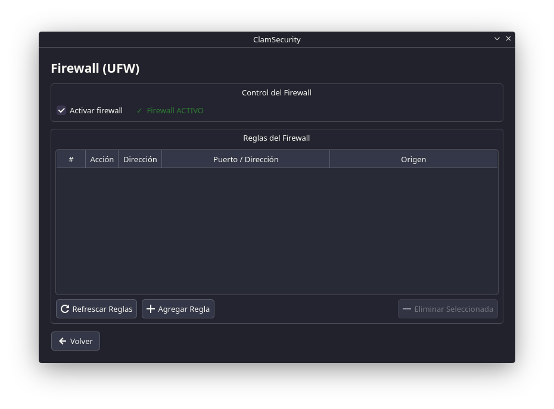
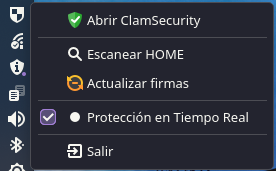

# ClamSecurity

Native Linux GUI that integrates **ClamAV** and **UFW** into a single application — antivirus, firewall, real-time protection and automatic signature updates, all from a unified dashboard.

> Built with Qt6/C++ · Tested on Manjaro KDE Plasma (Wayland/X11)

---

## Features

- **Status dashboard** with tri-state visual indicator (green / amber / red) and a detailed system health checklist
- **Flexible scanning** — custom folder, full Home, or a specific file/folder via Dolphin's context menu
- **Real-Time Protection** with `clamonacc` (fanotify) — detects threats the moment files are created or modified
- **On-Access Prevention** — blocks execution of infected files before they are opened
- **Quarantine** — suspicious files are moved, obfuscated and catalogued; restore or delete with one click
- **UFW Firewall** — enable/disable and manage rules without opening a terminal
- **Automatic signature updates** with `freshclam`; configure update frequency in hours from the UI
- **Active Threats** — detection history with date, path and available actions
- **Exclusions** — list of folders and extensions excluded from scanning
- **Scheduler** — automated scans with cron without writing a single line
- **System Tray** with protection indicator and hidden startup on login
- **No root required** — privileged commands use `pkexec` (standard KDE Polkit dialog)
- Languages: **Spanish** and **English** (auto-detected from system locale)

---

## Screenshots








---

## Prerequisites — run `setup.sh` first

Before building or running ClamSecurity for the first time, execute the included setup script. It automatically handles everything needed for ClamAV to work correctly on your system:

```bash
chmod +x setup.sh
./setup.sh
```

### What does `setup.sh` do?

| Step | Description |
|---|---|
| **Distro detection** | Identifies Arch/Manjaro, Debian/Ubuntu or Fedora and uses the correct package manager (`pacman` / `apt` / `dnf`) |
| **Install dependencies** | `clamav`, `acl`, `ufw` and the auxiliary packages required for each distro |
| **Comment out `Example`** | On Arch/Manjaro, `clamd.conf` and `freshclam.conf` ship with an `Example` directive that prevents services from starting; the script comments it out automatically |
| **Configure `clamd.conf`** | Appends a delimited section at the end of the file with real-time monitoring options (`OnAccessIncludePath`, `OnAccessPrevention`, exclusions for `.cache` and `Trash`) pointing to the user's Home |
| **clamonacc override** | Creates `/etc/systemd/system/clamav-clamonacc.service.d/override.conf` with the `-F` and `--log=…` flags to prevent the service from writing quarantine to `/root/quarantine` |
| **ACLs** | Grants `clamav` read-only access to the user's Home via `setfacl`, without adding it to the user's personal group or changing standard POSIX permissions. Default ACLs (`-d`) ensure new files are also accessible |
| **inotify** | Writes `/etc/sysctl.d/99-clamsecurity.conf` to raise `fs.inotify.max_user_watches` to 524 288. The default limit (8 192) is quickly exhausted when monitoring a Home with deeply nested directories, leaving ClamAV blind to events in deep subtrees |
| **Update signatures** | Runs `freshclam` to download the initial virus database |
| **Enable services** | Activates `clamav-daemon`, `clamav-clamonacc` (if present) and UFW |

---

## Build dependencies

```bash
# Qt6 and build tools
sudo pacman -S qt6-base qt6-tools cmake ninja base-devel

# Breeze icons (recommended in non-KDE environments)
sudo pacman -S breeze-icons

# polkit (usually already present on KDE)
sudo pacman -S polkit
```

On Debian/Ubuntu:

```bash
sudo apt-get install qt6-base-dev qt6-tools-dev cmake ninja-build build-essential libpolicykit-1-dev
```

On Fedora:

```bash
sudo dnf install qt6-qtbase-devel qt6-qttools-devel cmake ninja-build gcc-c++ polkit-devel
```

---

## Building

```bash
# From the project root
mkdir build && cd build
cmake .. -DCMAKE_BUILD_TYPE=Release -G Ninja
ninja
```

The binary will be at `build/ClamSecurity`. You can run it directly without installing.

### Install system-wide (optional)

```bash
sudo ninja install

# Register the .desktop entry and icon
sudo update-desktop-database /usr/local/share/applications/
sudo gtk-update-icon-cache -f /usr/local/share/icons/hicolor/ 2>/dev/null || true
kbuildsycoca6   # KDE only — refreshes the application menu
```

### Open in Qt Creator

1. `File → Open File or Project` → select `CMakeLists.txt`
2. Kit: **Qt 6.x (Desktop)**
3. `Configure Project` → `Build → Build All` (Ctrl+B)

---

## Running

```bash
# Normal launch
./build/ClamSecurity

# Scan a specific path
./build/ClamSecurity --scan /home/user/Downloads

# Start hidden in the System Tray
./build/ClamSecurity --hidden
```

---

## Dolphin Service Menu (right-click)

### From the GUI

1. Open ClamSecurity → **Settings**
2. Click **"Install Dolphin Service Menu"**
3. Restart Dolphin

### Manual

```bash
mkdir -p ~/.local/share/kio/servicemenus/
cp scripts/org.kde.clamsecurity.desktop ~/.local/share/kio/servicemenus/
chmod 644 ~/.local/share/kio/servicemenus/org.kde.clamsecurity.desktop
kquitapp6 dolphin; dolphin &
```

> If the binary is not in your `PATH`, edit the `Exec=` field in the `.desktop` file with the full path.

---

## Start with the system

### From the GUI

Settings → System Startup → enable **"Start with the system"**.

### Manual

```bash
mkdir -p ~/.config/autostart/
cat > ~/.config/autostart/ClamSecurity.desktop << 'EOF'
[Desktop Entry]
Type=Application
Name=ClamSecurity
Exec=ClamSecurity
Icon=security-high
Terminal=false
Categories=System;Security;
X-GNOME-Autostart-enabled=true
EOF
```

---

## Notes on Real-Time Protection

### clamonacc override

Without additional configuration, `clamonacc` may try to store quarantine in `/root/quarantine`. The override created by `setup.sh` forces the `-F` flag (foreground, required by systemd) and specifies the log path explicitly:

```ini
# /etc/systemd/system/clamav-clamonacc.service.d/override.conf
[Service]
ExecStart=
ExecStart=/usr/sbin/clamonacc -F --log=/var/log/clamav/clamonacc.log
```

You can also edit it manually with `sudo systemctl edit clamav-clamonacc.service`.

### ACLs — read access for clamav

`clamonacc` needs to read the user's Home to monitor files in real time. The safest way to grant this access is via ACLs:

```bash
sudo setfacl -m u:clamav:X /home/$USER          # traversal permission on Home
sudo setfacl -R -m u:clamav:rX /home/$USER      # read existing content
sudo setfacl -R -d -m u:clamav:rX /home/$USER   # inherit for new files
```

This does not add `clamav` to the user's personal group or change standard POSIX permissions.

### inotify limit

Linux limits the number of inotify watches to 8 192 by default. When ClamAV monitors a Home directory with many nested files and folders, this limit is exhausted and ClamAV stops receiving events from deep subtrees.

```bash
# Check current limit
cat /proc/sys/fs/inotify/max_user_watches

# Increase permanently (done automatically by setup.sh)
echo 'fs.inotify.max_user_watches=524288' | sudo tee /etc/sysctl.d/99-clamsecurity.conf
sudo sysctl --system
```

---

## Project structure

```
ClamSecurity/
├── setup.sh                            ← Initial system setup
├── CMakeLists.txt
├── src/
│   ├── main.cpp
│   ├── mainwindow.h / .cpp
│   ├── managers/
│   │   ├── ClamAvManager               ← clamscan / daemon / freshclam / clamonacc
│   │   ├── ClamdConfigManager          ← clamd.conf read/write
│   │   ├── FreshclamConfigManager      ← Update frequency in freshclam.conf
│   │   ├── QuarantineManager           ← Quarantine in ~/.local/share/ClamSecurity/
│   │   ├── UFWManager                  ← UFW control via pkexec
│   │   ├── SystemChecker               ← Tri-state global status
│   │   ├── SchedulerManager            ← Scheduled scans with cron
│   │   └── AutostartManager            ← ~/.config/autostart/
│   ├── workers/
│   │   └── ScanWorker                  ← clamscan in QThread
│   ├── core/
│   │   └── NotificationService         ← D-Bus + journal watcher
│   └── ui/
│       ├── MonitorWidget               ← Visual indicator (green/amber/red)
│       ├── ModuleCard                  ← Dashboard cards
│       ├── DetailsDialog               ← Detailed status checklist
│       ├── ScanPage
│       ├── DatabasePage
│       ├── ExclusionsPage
│       ├── QuarantinePage
│       ├── FirewallPage
│       ├── SettingsPage
│       ├── ActiveThreatsPage
│       └── ScheduledScansPage
├── resources/
│   ├── icons/clamsecurity.svg
│   └── ClamSecurity.qrc
├── scripts/
│   └── org.kde.clamsecurity.desktop    ← Dolphin Service Menu
├── translations/
│   ├── ClamSecurity_es.ts
│   └── ClamSecurity_en.ts
└── docs/
    └── images/                         ← Screenshots
```

---

## Security and privileges

- The application **never** runs as root.
- Privileged commands (`systemctl`, `ufw`, writing to `/etc/clamav/`) use `pkexec`, which shows the standard KDE Polkit authentication dialog.
- Scanning (`clamscan`) runs as the current user — it can only read files the user already has access to.
- Quarantine is stored in `~/.local/share/ClamSecurity/quarantine/`. Files are XOR-obfuscated to prevent accidental execution and indexed in JSON.

---

## Troubleshooting

| Problem | Solution |
|---|---|
| Monitor shows **RED** after install | Run `setup.sh` or start services: `sudo systemctl enable --now clamav-daemon` |
| `clamonacc` fails to start | Check `journalctl -u clamav-clamonacc` — likely missing override or ACLs |
| Quarantine appears in `/root/quarantine` | Apply the clamonacc override (see above or run `setup.sh`) |
| Service Menu missing in Dolphin | Reinstall from Settings or verify binary is in `PATH` |
| Signatures out of date | Use "Update Now" on the Database page or run `sudo freshclam` |
| `pkexec` cannot find the program | Install with `sudo ninja install` or use the absolute path |
| Notifications not arriving | Verify `OnAccessPrevention yes` is in `clamd.conf` and `clamonacc` is active |
| RT active but monitor shows **amber** | On-Access Prevention is disabled — enable it in Settings |
| inotify exhausted in logs | Increase `fs.inotify.max_user_watches` (done automatically by `setup.sh`) |

---

## License

Copyright (C) 2026 Josué Carrasco

This program is free software: you can redistribute it and/or modify it under the terms of the **GNU General Public License** as published by the Free Software Foundation, either version 3 of the License, or (at your option) any later version.

This program is distributed in the hope that it will be useful, but **WITHOUT ANY WARRANTY**. See the [LICENSE](LICENSE) file for details.
